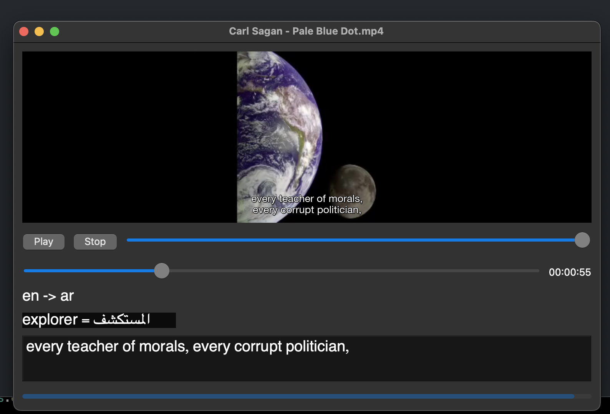

# VLC player with generated captions

A python .mp4 player that automatically transcribes subtitles and translations for these subtitles while watching a video.



Uses whisper to transcribe, googletrans to translate, python-vlc to create the player.
Supports 100+ languages (both as input and translation target).

The transcription quality of whisper is close to perfect, however, it struggles with load music in the background.
I personally use it to practice languages after downloading the .mp4 of a show I like. This way you can easily learn new words and immediately get the translation in your native language (when hovering over the word of interest).
ope you enjoy!

Requirements:
You must have ffmpeg installed!
```
# I used whisper version 20230314
python3 -m pip install openai-whisper
# vlc version 3.0.18122
python3 -m pip install --upgrade python-vlc
# PyQt6 version 6.4.2
python3 -m pip install PyQt6
# googletrans version 4.0.0-rc.1
python3 -m pip install googletrans
```

```
# get GUI with
python3 main.py
```
